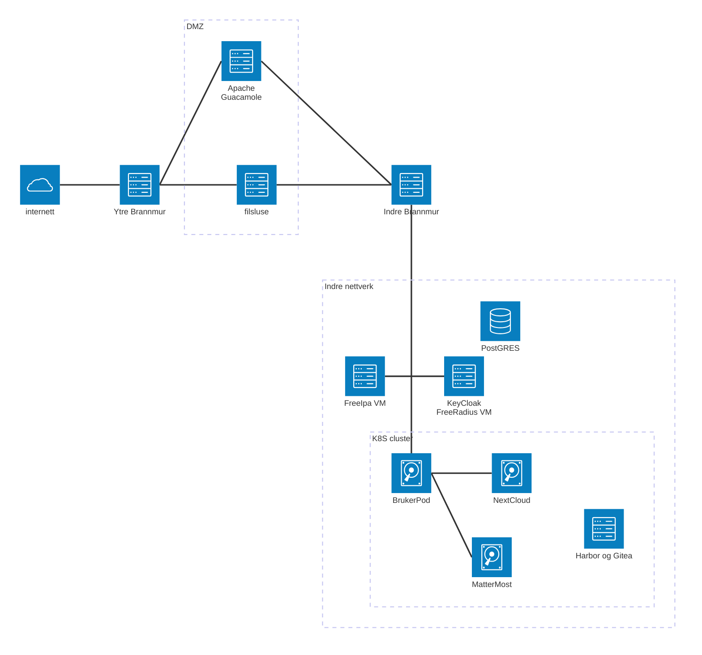

# Nu kjør vi!

En liksom sikker hjemmelab stort sett satt opp med IaC

## Mål

Målet er å ha en så godt som automatisert oppsett av en hjemmelab som også er rimelig sikker. Og det med bruk av stort sett verktøy med åpen kildekode.

### Tenkt arkitektur

Dette er et forsøk på å tegne arkitekturen.

## Tech støff

Hva er det som hjemmelabben skal bestå av?

### Jern

- Lenovo Thinkcentre M920q Tiny, i9, 32GB RAM, 512GB SSD, WiFi

### Programvare

Nøkkelprogrammer:

- Proxmox VE [lenke](https://www.proxmox.com/en/)
- Rocky Linux [lenke](https://rockylinux.org/no-NO)
- Ubuntu 24.04 [lenke](https://ubuntu.com/)
- OPNsense/pfSense [lenke](https://opnsense.org/)
- FreeIPA [lenke](https://www.freeipa.org/)
- KeyCloal [lenke](https://www.keycloak.org/)
- kubernetes [lenke](https://kubernetes.io/)
- NextCloud [lenke](https://nextcloud.com/)
- MatterMost [lenke](https://mattermost.com/)
- apache guacemole [lenke](https://guacamole.apache.org/)
- Wiki.js [lenke](https://js.wiki/)
- OpenProject [lenke](https://www.openproject.org/)
- Kasm workspaces [lenke](https://kasmweb.com/)
- Harbor [lenke](https://goharbor.io/)
- Gitea [lenke](https://about.gitea.com/)

Verktøy:

- openTofu [lenke](https://opentofu.org/)
- ansible [lenke](https://docs.ansible.com/)

## Eksterne bruksanvisninger

Ting som jeg har brukt for å lære meg de diverse programvarene.

- apalrd's adventures [on youtube](https://www.youtube.com/@apalrdsadventures/videos)
- DevOps Directive [Complete Terraform Course - From BEGINNER to PRO! (Learn Infrastructure as Code)](https://youtu.be/7xngnjfIlK4?si=ZchQDAig5tDmNIJv)
- Christian Lempa [Proxmox virtual machine _automation_ in Terraform](https://youtu.be/dvyeoDBUtsU?si=VmtJZ-79wN5DhZaa)
- Learn Linux TV [Kasm Workspaces Simplified: The Essential Guide for New Users](https://youtu.be/U5-oNbNEJYI?si=P82qzUjAKjwV8IMi)
